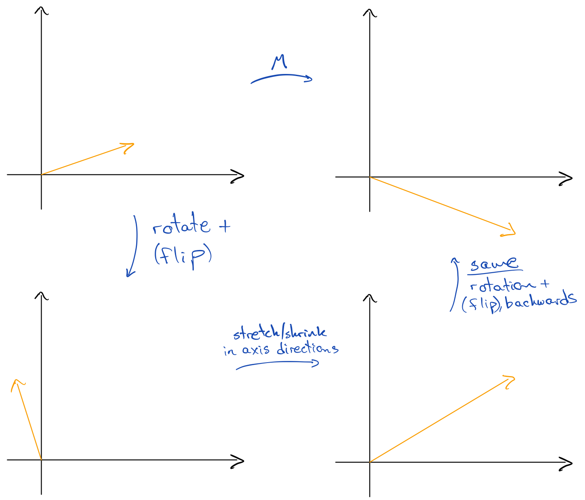
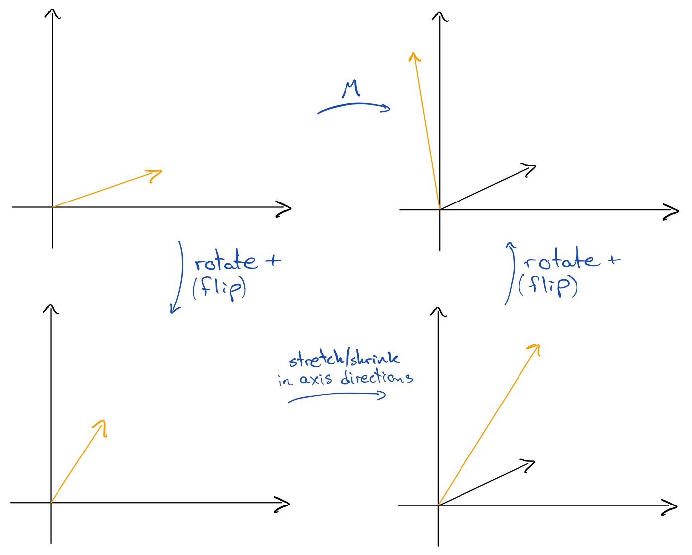

Whenever we are dealing with a complicated problem, it usually helps to break it into smaller pieces that are easier to handle. This is as true in mathematics and machine learning as it is when we're cooking a meal or cleaning our home. This idea is what's the guiding principle to the _singular value decomposition_.

This decomposition is the muscle behind things like dimensionality reduction of our data using Principal Component Analysis, and computing pseudoinverses of matrices when we're building linear regression models.

Let's start by remembering that an $m\times n$ matrix $M$ can also be seen as a linear transformation $f\colon\mathbb R^n\to\mathbb R^m$ by setting $f(\vec x):=M\vec x$. Linear transformations are quite simple, as they can only do three things:
  * They can **rotate** vectors
  * They can **flip** vectors
  * They can **stretch/shrink** vectors

Because mathematicians like to make things seem complicated, we invent a lot of complicated terminology to simple ideas: a matrix is called **orthogonal** if it only rotates and potentially flips:

{: style="text-align:center"}

It's **diagonal** if it only stretches/shrinks in the axis directions:

{: style="text-align:center"}

To apply the aforementioned idea of breaking into smaller pieces, a way of simplifying a matrix could then be to somehow split it up into these three factors.

The first decomposition that we'll look at, the **eigendecomposition**, does this by isolating a collection of special vectors which are *not rotated* and *stretched/shrunk the same amount in all directions*: our transformation only potentially flips and "uniformly" stretches/shrinks these special ones. Of course this comes with its own cryptic terminology: these special vectors are called **eigenvectors**, and the amount that they are uniformly stretched/shrunk are the **eigenvalues**.

The decomposition then first rotates and potentially flips a given vector, then uniformly stretches/shrinks it and potentially flips it, and rotates and potentially flips it back again:

{: style="text-align:center"}

There is a problem, however: it doesn't always work. We firstly have to assume that $M$ is a **square matrix**, meaning that $m=n$, because we're doing the same rotation (in reverse) after we stretch/shrink and so we have to stay in the same space.

Being a square matrix is not even enough, as we also require that $M$ is *symmetric* and *positive semi-definite*. More jargon! Let's look at those one at a time.

A transformation is **symmetric** if applying it twice cancels out all rotations and flips; i.e. only stretching/shrinking stays after the second transformation:

{: style="text-align:center"}

Next, a symmetric transformation is **positive semi-definite** if no vector is flipped. As it's also symmetric this means that any vector which is rotated will have to be rotated back to its starting position after applying the transformation again. In two dimensions this reduces to only allowing scaling. This is still more general than a diagonal transformation however, as we allow scaling in directions different from the axis directions, causing skewness:

{: style="text-align:center"}

In three dimensions (and higher) we can get positive semi-definite transformations that aren't just scalings, see for instance [this video](https://www.youtube.com/watch?v=-PYDcHKPMKk).

Here's the precise statement of the eigendecomposition:

> **Theorem** (Eigendecomposition). Let $M$ be a square matrix which is both symmetric and positive semi-definite. Then there exists an orthogonal matrix $Q$ and a diagonal matrix $\Lambda$ such that $M=Q\Lambda Q^{-1}$.

The generalisation of the eigendecomposition to *all* matrices is then the **singular value decomposition**. Instead of performing the *same* rotation and potential flip before and after the uniform scaling, we allow them to be different.

We therefore isolate some *special vectors* again, where in this case "special" only means that they are "uniformly" stretched/shrunk, i.e. that the stretching/shrinking are equal in all directions. This is *almost* the same thing as the eigenvectors, except that we allow them to be rotated. We call these special vectors **singular vectors**, and the amount that they're stretched/shrunk are the **singular values**.

The decomposition is then saying that any transformation can be split up into a (1) rotation + potential flip, (2) uniform stretching/shrinking and (3) another (potentially different) rotation + potential flip:

{: style="text-align:center"}

You can find a cool interactive animation of the decomposition [here](https://www.geogebra.org/m/mrey8VJX). Here's the precise statement of the decomposition.

> **Theorem** (Singular Value Decomposition). Any real-valued $m\times n$ matrix $M$ can be written as $M=U\Sigma V^T$, where $U$ and $V$ are orthogonal matrices of dimensions $m\times m$ and $n\times n$ matrix, respectively, and $\Sigma$ is a diagonal $m\times n$ matrix. Further, if we let $\sigma_i$ be the $i$'th diagonal entry of $\Sigma$ then
> 
> $$ \sigma_1 \geq \sigma_2 \geq \dots \geq \sigma_p $$
> 
> where $p:=\min(m,n)$ and $\sigma_i=0$ for all $i>p$.

That's it! You can check out the proof of this theorem [here](http://www.ee.cuhk.edu.hk/~wkma/engg5781/new_notes/lecture%205-%20SVD-%20note.pdf).

Tune in next week for some data science applications of this decomposition!
